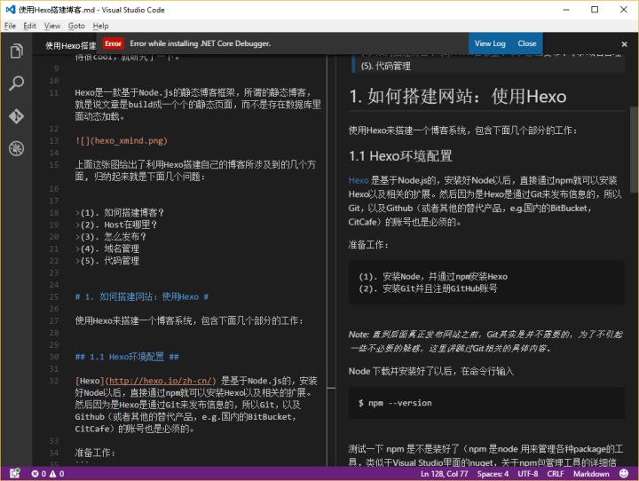

Markdown
======

# 1. 使用场景

* 学习笔记
* 演讲稿
* 写书（侧重于 **技术相关的内容** 非常适合）
* 个人笔记
* 文章博客
* 教学讲义
* 说明文档
* 电子邮件
* 只要有写作的地方，都可以使用 `Markdown` 来书写

# 2. 安装与环境配置

## 2.1. Sublime Text

按下键 `Ctrl + Shift + p` 调出命令面板，找到 `Package Control: install Pakage` 这一项。搜索 `markdown preview` ，点击安装。

`Markdown Preview` 较常用的功能是 `preview in browser` 和 `Export HTML in Sublime Text` ，前者可以在浏览器看到预览效果，后者可将 `markdown` 保存为 `html` 文件。

`preview in browser` 据称是实时的，但是实践上还是需要在 Sublime Text 保存，然后浏览器刷新才能看到新的效果，好在 `Markdown` 写得多的话也不需要每敲一行看一次效果。

## 2.2. Webstorn

打开 **Webstorm** ，`File` --> `Setting` -->输入 `plugin` --> `Install JetBrains plugin...` -->输入 `Markdown` --> 点击右边的 `Install` ，安装完，重启 Webstorm。

## 2.3. VScode

**Visual Studio Code** 自带 `Markdown` 预览，所以不需要安装插件。当然为了效率，推荐安装几款插件：

* Markdown Preview Github Styling -- 显示出近乎Github的效果
* Markdown Preview Enhanced -- 强大的预览工具
* Markdown All in One -- 听名字就知道了
* Markdown TOC -- 自动生成目录工具

笔者比较喜欢使用VScode作为书写 `Markdown` 的工具。

## 2.4. Typora

一款非常优雅的 `Markdown` 编辑器，适合初学者使用，功能上不如前三者强大。[Typora官方网址](https://www.typora.io/)

# 3. Demo

## 3.1. 标题

```markdown
 h1
# h2
## h3
### h4
#### h5
##### h6
h1
======
h2
------
```

## 3.2. 水平线

```markdown
* * *
***
*****
- - -
---------------------------------------
```

## 3.3. 字体

```markdown
**Bold**
__emphasize__
regular

*italic1*
_italic2_

_**组合强调**_

~~delete~~
```

效果如下：

**Bold**
__emphasize__
regular

*italic*
_italic_

_**组合强调**_

~~delete~~

## 3.4. 列表

```markdown
* java
* python
* javascript

+ item1
+ item2
+ item3

- item1
- item2
- item3

1. java
2. python
3. javascript
```

无序列表：

* java
* python
* javascript

有序列表：

1. java
2. python
3. javascript

## 3.5. 段落就是加空行

paragraph1

paragraph2

paragraph3

## 3.6. 链接

```markdown
[内嵌式链接](https://www.google.com)

[带标题的内嵌式链接](https://www.google.com "谷歌的主页")

[引用式链接][arbitrary case-insensitive reference text]

[相对引用一个库文件](README.md)

[你可以在引用式链接定义中使用数字][1]

或者空着什么都不写 [link text itself]

[arbitrary case-insensitive reference text]: https://www.mozilla.org
[1]: http://slashdot.org
[link text itself]: http://www.reddit.com
```

效果如下：

[内嵌式链接](https://www.google.com)

[带标题的内嵌式链接](https://www.google.com "谷歌的主页")

[引用式链接][arbitrary case-insensitive reference text]

[相对引用一个库文件](README.md)

[你可以在引用式链接定义中使用数字][1]

或者空着什么都不写 [link text itself]

[arbitrary case-insensitive reference text]: https://www.mozilla.org
[1]: http://slashdot.org
[link text itself]: http://www.reddit.com

## 3.7. 脚注

```markdown
这是一段文字[^1]

这又是一段文字[^n]

[^1]: This is my first footnote
[^n]: Visit http://ghost.org
[^n]: A final footnote
```

效果如下：

这是一段文字[^1]

这又是一段文字[^n]

[^1]: This is my first footnote
[^n]: Visit http://ghost.org
[^n]: A final footnote

## 3.8. 图片

```markdown


<!-- 引用式常常不起作用，推荐使用内嵌式 -->
![引用式][pic]
[pic]: assets//pic1.png "图片的文字"
```

效果如下：


![引用式][pic]
[pic]: assets/pic1.png "图片的文字"

## 3.9. 代码

```javascript
var s = "JavaScript语法高亮";
alert(s);
```

```python
s = "Python语法高亮"
print s
```

[Markdown代码高亮支持的语言](https://www.jianshu.com/p/f02d5a3736ba)

```txt
没有指明语言(txt)，所有没有语法高亮。
```

## 3.10. 表格

```markdown
| Tables        | Are           | Cool  |
| ------------- |:-------------:| -----:|
| col 3 is      | right-aligned | $1600 |
| col 2 is      | centered      |   $12 |
| zebra stripes | are neat      |    $1 |

Markdown | Less | Pretty
--- | --- | ---
*Still* | `renders` | **nicely**
1 | 2 | 3
```

效果如下：

| Tables        | Are           | Cool  |
| ------------- |:-------------:| -----:|
| col 3 is      | right-aligned | $1600 |
| col 2 is      | centered      |   $12 |
| zebra stripes | are neat      |    $1 |

Markdown | Less | Pretty
--- | --- | ---
*Still* | `renders` | **nicely**
1 | 2 | 3

## 3.11. 引用

> 在邮件中块引用中很方便用来仿真文本的回复。
>
> 这行是同一个块的一部分。

引用结束

> 当这行很长的文字被包裹的时候，它依然会被恰当的引用。让我们继续写下去来确保包裹它时对于每个人来说它足够长。你可以*在*块引用中使用其它**Markdown**。

## 3.12. 视频

```markdown
[](https://www.bilibili.com/video/av26945253/?spm_id_from=333.334.chief_recommend.16)
```

[](https://www.bilibili.com/video/av26945253/?spm_id_from=333.334.chief_recommend.16)

## 3.13. 转义字符

```markdown
空格：&nbsp;
小于号：&lt;
大于号：&gt;
和号：&amp;
双引号：&quot;
单引号：&apos;
版权：&copy;
注册商标：&reg;
乘号：&times;
除号：&divide;
```

空格：&nbsp;
小于号：&lt;
大于号：&gt;
和号：&amp;
双引号：&quot;
单引号：&apos;
版权：&copy;
注册商标：&reg;
乘号：&times;
除号：&divide;

更多资源
======

[GitBook](https://chrisniael.gitbooks.io/gitbook-documentation/content/format/markdown.html)

[markdown官方文档](https://markdown-zh.readthedocs.io/en/latest/)

[Learning-Markdown (Markdown 入门参考)](http://xianbai.me/learn-md/index.html)

[Markdown语法手册](https://www.zybuluo.com/xxliixin1993/note/125827)
