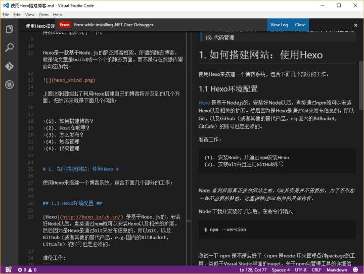

# markdown

## 目录

- [markdown](#markdown)
    - [目录](#%E7%9B%AE%E5%BD%95)
    - [1. Markdown 使用场景](#1-markdown-%E4%BD%BF%E7%94%A8%E5%9C%BA%E6%99%AF)
    - [2. Markdown安装与环境配置](#2-markdown%E5%AE%89%E8%A3%85%E4%B8%8E%E7%8E%AF%E5%A2%83%E9%85%8D%E7%BD%AE)
        - [2.1 Sublime Text](#21-sublime-text)
        - [2.2 Webstorn](#22-webstorn)
        - [2.3 vscode](#23-vscode)
    - [3. 关于Sublime Text](#3-%E5%85%B3%E4%BA%8Esublime-text)
    - [4. demo](#4-demo)
        - [4.1 标题](#41-%E6%A0%87%E9%A2%98)
        - [4.2 水平线](#42-%E6%B0%B4%E5%B9%B3%E7%BA%BF)
        - [4.3 字体](#43-%E5%AD%97%E4%BD%93)
        - [4.4 列表](#44-%E5%88%97%E8%A1%A8)
        - [4.5 段落就是加空行](#45-%E6%AE%B5%E8%90%BD%E5%B0%B1%E6%98%AF%E5%8A%A0%E7%A9%BA%E8%A1%8C)
        - [4.6 链接](#46-%E9%93%BE%E6%8E%A5)
        - [4.7 脚注](#47-%E8%84%9A%E6%B3%A8)
        - [4.8 图片](#48-%E5%9B%BE%E7%89%87)
        - [4.9 代码](#49-%E4%BB%A3%E7%A0%81)
        - [4.10 表格](#410-%E8%A1%A8%E6%A0%BC)
        - [4.11 引用](#411-%E5%BC%95%E7%94%A8)
        - [4.12 视频](#412-%E8%A7%86%E9%A2%91)
        - [4.13 转义字符](#413-%E8%BD%AC%E4%B9%89%E5%AD%97%E7%AC%A6)
    - [更多资源](#%E6%9B%B4%E5%A4%9A%E8%B5%84%E6%BA%90)

## 1. Markdown 使用场景

* 学习笔记
* 演讲稿
* 写书（侧重于 **技术相关的内容** 非常适合）
* 个人笔记
* 文章博客
* 教学讲义
* 说明文档
* 电子邮件
* 只要有写作的地方，都可以使用 **Markdown** 来书写

## 2. Markdown安装与环境配置

### 2.1 Sublime Text

按下键 ```Ctrl + Shift + p``` 调出命令面板，找到 ```Package Control: install Pakage``` 这一项。搜索 ```markdown preview``` ，点击安装。

```Markdown Preview``` 较常用的功能是 ```preview in browser``` 和 ```Export HTML in Sublime Text``` ，前者可以在浏览器看到预览效果，后者可将 **markdown** 保存为 html 文件。

```preview in browser``` 据称是实时的，但是实践上还是需要在 **Sublime Text** 保存，然后浏览器刷新才能看到新的效果，好在 **markdown** 写得多的话也不需要每敲一行看一次效果。

### 2.2 Webstorn

打开 **webstorm** ，```File```-->```Setting```-->输入```plugin```-->```Install JetBrains plugin...```-->输入```markdown```-->点击右边的 ```Install``` ，安装完，重启 **webstorm**。

### 2.3 vscode

**Visual Studio Code** 自带 **markdown** 预览，所以不需要安装插件，不过可以安装语法高亮主题

## 3. 关于Sublime Text

* MarkdownEditing 主题、自动补齐等功能
* MarkdownPreview 在浏览器预览
* MarkdownTOC 自动生成导航
* Table Editor 自动表格编辑
* packagecontrol Sublime 的插件生态系统网站

## 4. demo

### 4.1 标题

```markdown
# h1
## h2
### h3
#### h4
##### h5
###### h6
h1
======
h2
------
```

### 4.2 水平线

```markdown
* * *
***
*****
- - -
---------------------------------------
```

### 4.3 字体

```markdown
**Bold**
__emphasize__
regular

*italic1*
_italic2_

_**组合强调**_

~~delete~~ or <del>del</del>
```

效果如下：

**Bold**
__emphasize__
regular

*italic*
_italic_

_**组合强调**_

~~delete~~

### 4.4 列表

```markdown
* java
* python
* javascript

+ item1
+ item2
+ item3

- item1
- item2
- item3

1. java
2. python
3. javascript
```

无序列表：

* java
* python
* javascript

有序列表：

1. java
2. python
3. javascript

### 4.5 段落就是加空行

paragraph1

paragraph2

paragraph3

### 4.6 链接

```markdown
[内嵌式链接](https://www.google.com)

[带标题的内嵌式链接](https://www.google.com "谷歌的主页")

[引用式链接][arbitrary case-insensitive reference text]

[相对引用一个库文件](README.md)

[你可以在引用式链接定义中使用数字][1]

或者空着什么都不写 [link text itself]

[arbitrary case-insensitive reference text]: https://www.mozilla.org
[1]: http://slashdot.org
[link text itself]: http://www.reddit.com
```

效果如下：

[内嵌式链接](https://www.google.com)

[带标题的内嵌式链接](https://www.google.com "谷歌的主页")

[引用式链接][arbitrary case-insensitive reference text]

[相对引用一个库文件](README.md)

[你可以在引用式链接定义中使用数字][1]

或者空着什么都不写 [link text itself]

[arbitrary case-insensitive reference text]: https://www.mozilla.org
[1]: http://slashdot.org
[link text itself]: http://www.reddit.com

### 4.7 脚注

```markdown
这是一段文字[^1]

这又是一段文字[^n]

[^1]: This is my first footnote
[^n]: Visit http://ghost.org
[^n]: A final footnote
```

效果如下：

这是一段文字[^1]

这又是一段文字[^n]

[^1]: This is my first footnote
[^n]: Visit http://ghost.org
[^n]: A final footnote

### 4.8 图片

```markdown


![引用式][pic]
[pic]: https://github.com/fuerlai/git_learn/pic1.png "图片的文字"
```

 效果如下：



![引用式][pic]
[pic]: pic1.png "图片的文字"

### 4.9 代码

```javascript
var s = "JavaScript语法高亮";
alert(s);
```

```python
s = "Python语法高亮"
print s
```

[Markdown代码高亮支持的语言](https://www.jianshu.com/p/f02d5a3736ba)

```txt
没有指明语言(txt)，所有没有语法高亮。
```

### 4.10 表格

```markdown
| Tables        | Are           | Cool  |
| ------------- |:-------------:| -----:|
| col 3 is      | right-aligned | $1600 |
| col 2 is      | centered      |   $12 |
| zebra stripes | are neat      |    $1 |

Markdown | Less | Pretty
--- | --- | ---
*Still* | `renders` | **nicely**
1 | 2 | 3
```

效果如下：

| Tables        | Are           | Cool  |
| ------------- |:-------------:| -----:|
| col 3 is      | right-aligned | $1600 |
| col 2 is      | centered      |   $12 |
| zebra stripes | are neat      |    $1 |

Markdown | Less | Pretty
--- | --- | ---
*Still* | `renders` | **nicely**
1 | 2 | 3

### 4.11 引用

> 在邮件中块引用中很方便用来仿真文本的回复。
>
> 这行是同一个块的一部分。

引用结束

> 当这行很长的文字被包裹的时候，它依然会被恰当的引用。让我们继续写下去来确保包裹它时对于每个人来说它足够长。你可以*在*块引用中使用其它**Markdown**。

### 4.12 视频

```markdown
[](https://www.bilibili.com/video/av26945253/?spm_id_from=333.334.chief_recommend.16)
```

[](https://www.bilibili.com/video/av26945253/?spm_id_from=333.334.chief_recommend.16)

### 4.13 转义字符

```markdown
空格：&nbsp;
小于号：&lt;
大于号：&gt;
和号：&amp;
双引号：&quot;
单引号：&apos;
版权：&copy;
注册商标：&reg;
乘号：&times;
除号：&divide;
```

空格：&nbsp;
小于号：&lt;
大于号：&gt;
和号：&amp;
双引号：&quot;
单引号：&apos;
版权：&copy;
注册商标：&reg;
乘号：&times;
除号：&divide;

## 更多资源

[GitBook](https://chrisniael.gitbooks.io/gitbook-documentation/content/format/markdown.html)

[markdown官方文档](https://markdown-zh.readthedocs.io/en/latest/)

[Learning-Markdown (Markdown 入门参考)](http://xianbai.me/learn-md/index.html)

[Markdown语法手册](https://www.zybuluo.com/xxliixin1993/note/125827)