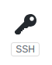
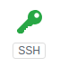

远程仓库
======

远程仓库可以是`github`、`gitlab`、`gitbook`等，笔者以 `github` 为例。
<!-- TOC -->

- [1. 创建 SSH Key](#1-创建-ssh-key)
- [2. 在 GitHub 添加 SSH Key](#2-在-github-添加-ssh-key)
- [3. 在 Github 新建仓库](#3-在-github-新建仓库)
- [4. 本地仓库与远程仓库关联](#4-本地仓库与远程仓库关联)
- [5. 上传到远程仓库](#5-上传到远程仓库)
- [6. 报错之一](#6-报错之一)
- [7. 报错之二](#7-报错之二)

<!-- /TOC -->
# 1. 创建 SSH Key

在用户主目录下，看看有没有 `.ssh` 目录，如果有，再看看这个目录下有没有 `id_rsa`  和 `id_rsa.pub` 这两个文件。如果已经有了，可直接跳到下一步。

如果没有：

```ssh
ssh-keygen -t rsa -C "youremail@example.com"
```

* id_rsa -- 私钥，用于解密，需要严格保密
* id_rsa.pub -- 公钥，用于加密，需要上传服务器

# 2. 在 GitHub 添加 SSH Key

登录Github（如果没有帐号，请创建一个），打开 `Account settings` > `SSH Keys` 页面，点 `Add SSH Key`，填上任意 Title，在 Key 文本框里粘贴 `id_rsa.pub` 文件的内容。

添加的 SSH Key 是新的，还未使用过，会显示这样的黑色图标。



用终端来测试与 Guthub 主机的连接

```git
ssh -T git@github.com
```

看到你的 Github 用户名时候，就说明可以连接到 Github。

```git
Hi fuerlai! You've successfully authenticated, but GitHub does not provide shell access.
```

再看 Github 上刚才那该个 SSH Key，发现图标变成了绿色。



# 3. 在 Github 新建仓库

登录GitHub，在右上角找到 `Create a new repo` 按钮，创建一个新的仓库。新建仓库的过程比较简单，注意三点：

1. 起一个比较好的项目名（实际上就是仓库名）
2. 选一个好的 `LICENCE`
3. 初始化 `README.md` 文件（这是项目/仓库的默认介绍）

# 4. 本地仓库与远程仓库关联

```git
git remote add origin git@github.com:fuerlai/git_learn.git
```

**注意** ：
1. 把上面的 `fuerlai` 替换成你自己的 GitHub 账户名
2. `git_learn` 换成你的仓库名

# 5. 上传到远程仓库

假设已经把代码都提交到了本地仓库，现在只需要一句 `push` 命令就可以将所有代码上传到远程仓库。

```git
git push -u origin master(首次上传)
git push origin master
```

# 6. 报错之一

```git
#! [rejected]        master -> master (fetch first)
#error: failed to push some refs to 'git@github.com:fuerlai/git_learn.git'
```

我发生这个错误的原因是：在 GitHub 上创建的 repo 勾选了 `README.md` ，但是本地版本库中没有 `README.md` 。实际上，在首次将本地仓库提交到远程仓库时，只要你的远程仓库中有本地仓库中没有的文件，就会发生此类错误。解决办法是：通过如下命令将远程仓库中多出来的文件拷贝到本地仓库，然后进行代码合并，合并后在上传到远程仓库。

```git
// pull = fetch + merge
git pull --rebase origin master
```

# 7. 报错之二

```git
git remote add origin git@github.com:fuerlai/git_learn.git
#bash: $'\302\203git': command not found
```

此类错误的原因不甚了解，可能与 `git` 命令的执行环境有关系，可以通过如下命令解决。

```git
git status
git remote add origin git@github.com:fuerlai/git_learn.git
ssh -T git@github.com
git remote add origin
```
